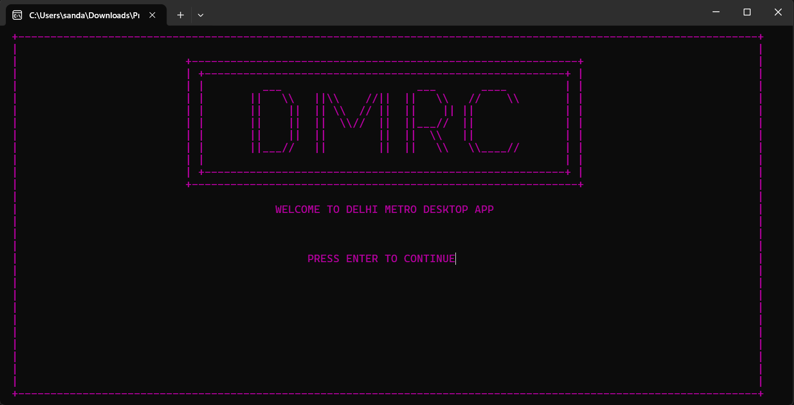
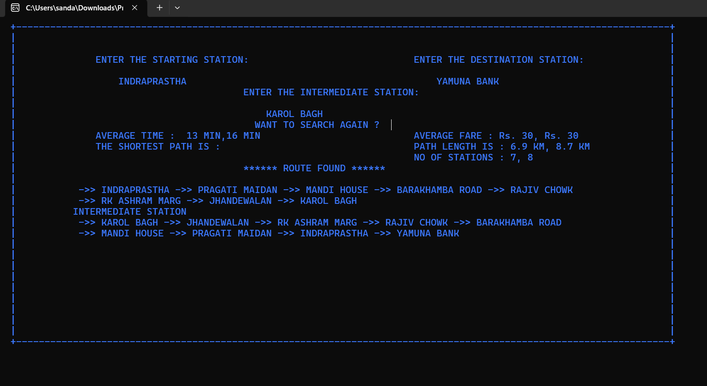

# DMRC (Delhi Metro Rail Corporation) Route Planner

Welcome to the DMRC Route Planner repository, where we have developed and optimized route planning algorithms using C++ and Dijkstra's algorithm specifically tailored for the Delhi Metro Rail Corporation.

## Key Features
- **Dijkstra's Algorithm**: Efficient computation of shortest paths between metro stations, crucial for real-time route planning and optimization.
- **Graph Representation**: Implementation of metro network as a graph data structure in C++, enabling quick traversal and pathfinding algorithms.
- **User Interface**: Command-line interface (CLI) for users to input start and destination stations, receiving optimal routes and travel times as output.
- **Performance Optimization**: Techniques to enhance algorithm performance, considering large-scale metro networks and varying traffic conditions.
- **Data Structures**: Utilization of advanced data structures such as priority queues and adjacency lists for optimized graph traversal and memory efficiency.

## Screenshots
Here are some screenshots showcasing the DMRC Route Planner in action:

*Caption: Example of the command-line interface displaying DMR interface.*

*Caption: Example of the command-line interface displaying route planning results.*

*Caption: Visualization of metro network graph representation.*

## Technologies Used
C++, Dijkstra's Algorithm, Data Structures, Command-line Interface (CLI).

## Contact
For inquiries about the DMRC Route Planner project, please contact [Sandarbh Kansal](mailto:sandarbhkansal8@gmail.com) OR [Manoj Pallakki](mailto:thippareddy.bt@gmail.com).
